# APELLIDO Y NOBRE: 
# CHUCHON NUÑEZ, MARIANO

0. Clonar el repositorio [`oneAPI-samples`](https://github.com/oneapi-src/oneAPI-samples) [1 punto]
## RESPUESTA_0:
comando: 
u185966@login-2:~$ git clone https://github.com/oneapi-src/oneAPI-samples

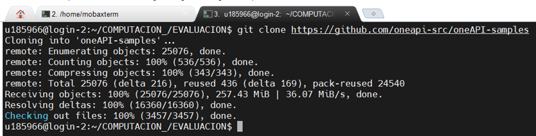

1. Cambiar al directorio del ejemplo `Nbody`  [1 punto]
    - Directorio: `oneAPI-samples/tree/master/DirectProgramming/C++SYCL/N-BodyMethods/Nbody`
## RESPUESTA_1:
comando:
u185966@login-2:~/COMPUTACION_/EVALUACION/oneAPI-samples/DirectProgramming/C++SYCL/N-BodyMethods/Nbody$ pwd
/home/u185966/COMPUTACION_/EVALUACION/oneAPI-samples/DirectProgramming/C++SYCL/N-BodyMethods/Nbody

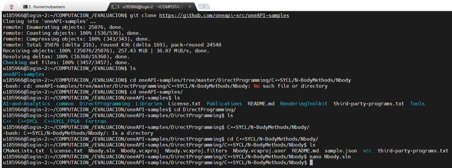

2. Explicar brevemente el algoritmo de `Nbody` [3 puntos]
## RESPUESTA_2:

El código del algoritmo Nbody simula un sistema dinámico de partículas de 16 000 partículas en diez pasos de integración. Los parámetros de posición, velocidad y aceleración de cada partícula dependen de otras (N-1) partículas.

3. Acceder en modo interactivo a un nodo de cómputo con GPUs (`gen9` o `gen11`) [3 puntos]
    - Compilar y ejecutar `Nbody`
    - Proporcionar screenshot(s) de los resultados
        - Por cada screenshot, añadir una breve descripción
## RESPUESTA_3:
Se accede al nodo 11 como se muestra en la figura siguiente:

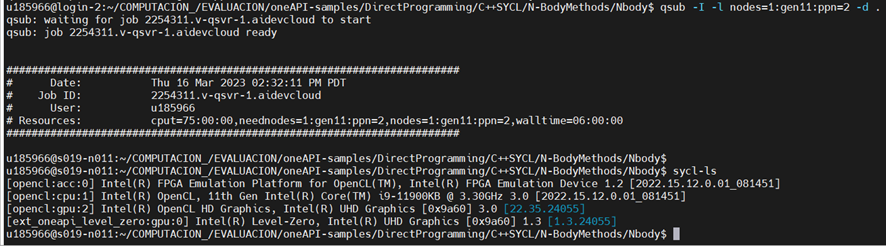

Se lista el directorio Nbody

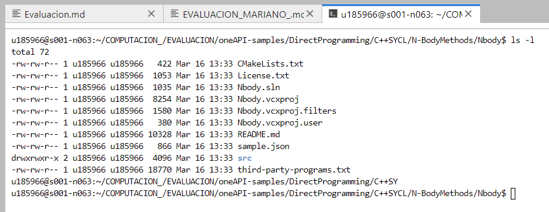

Se compila el Nbody

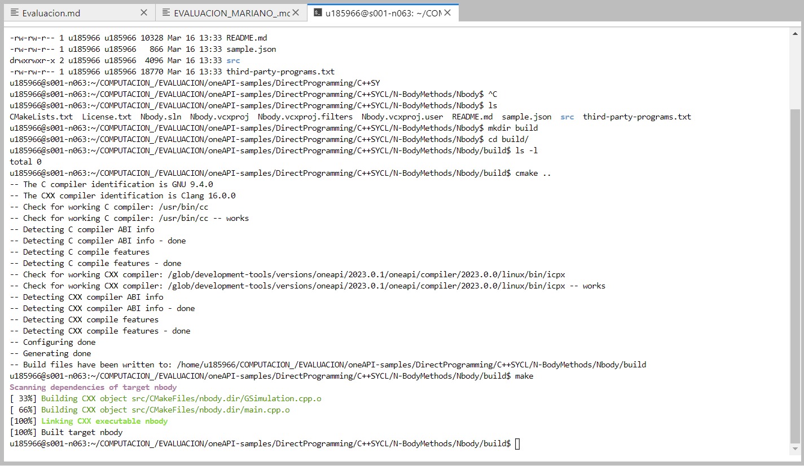

Se continua compilando Nbody

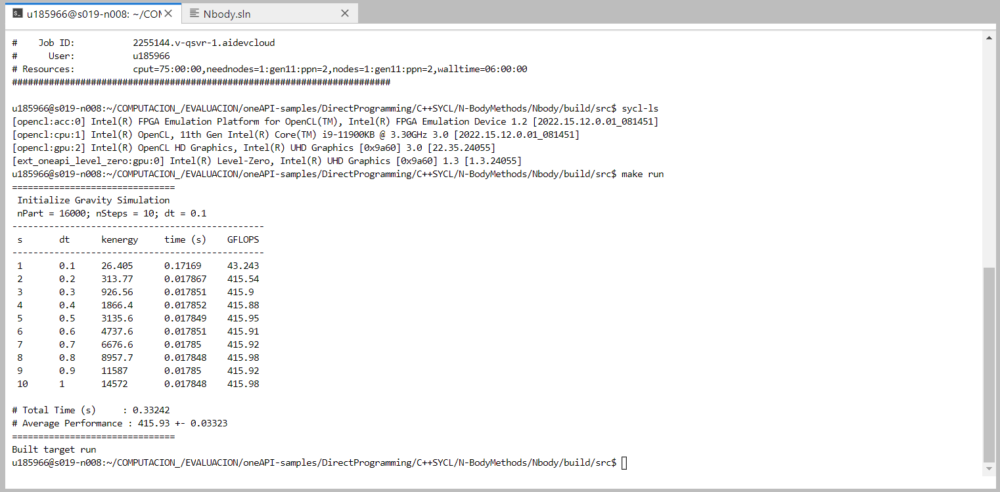

4. Realizar un análisis de _**GPU Hotspots**_ con VTune [8 puntos]
    - Indicar los hotspots del programa
    - Proporcionar screenshot(s) de los resultados
      - Por cada screenshot, añadir una breve descripción
## RESPUESTA_4:

En la figura se muestra la generacion de archivo para VTUNE

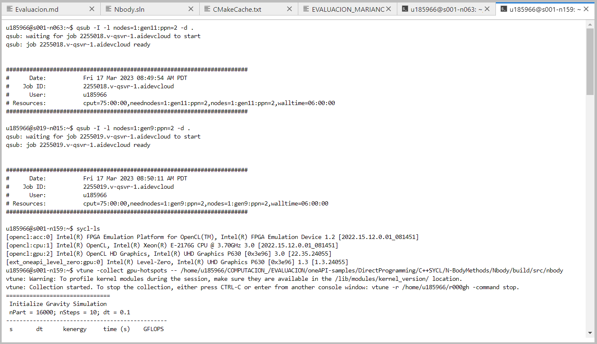

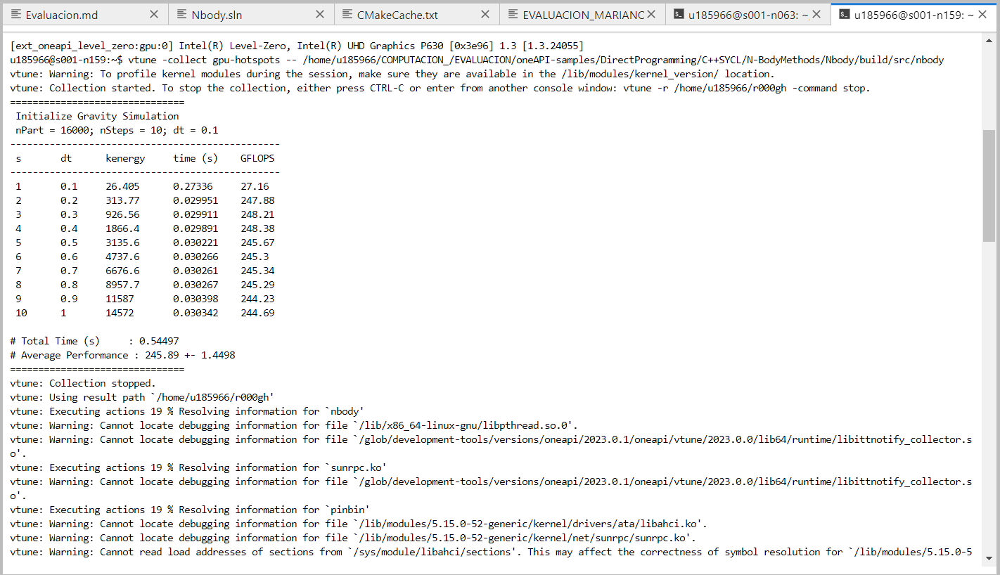

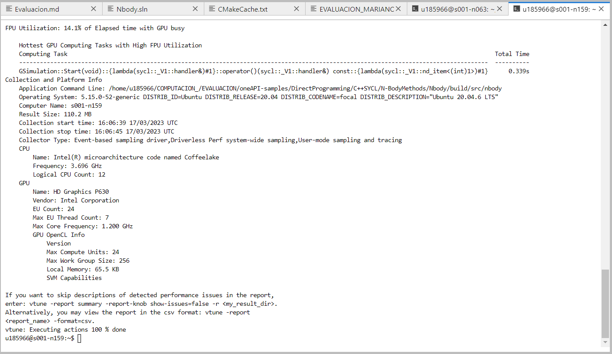

Generacion del archivo para VTUNE

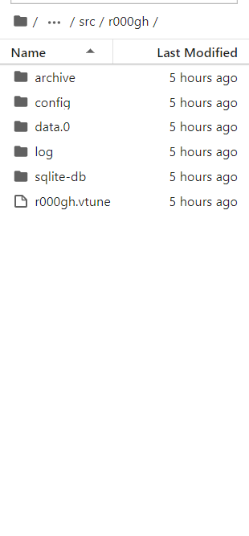

Analisis de VTUNE

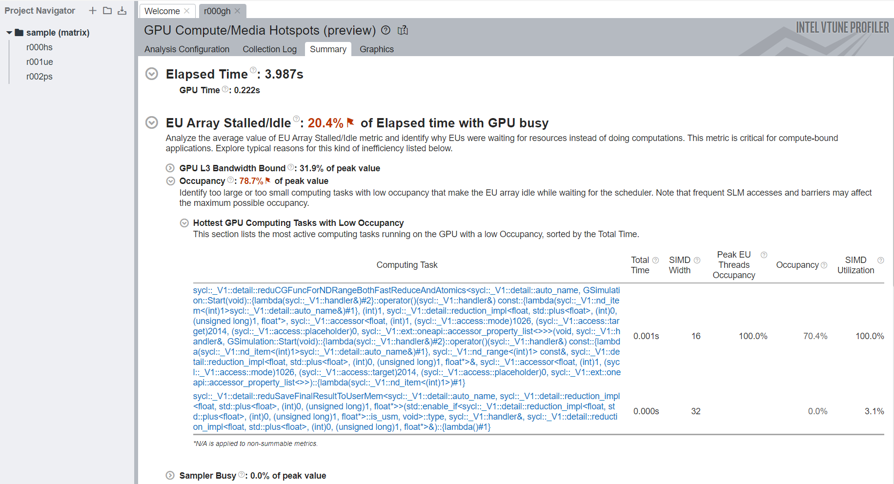

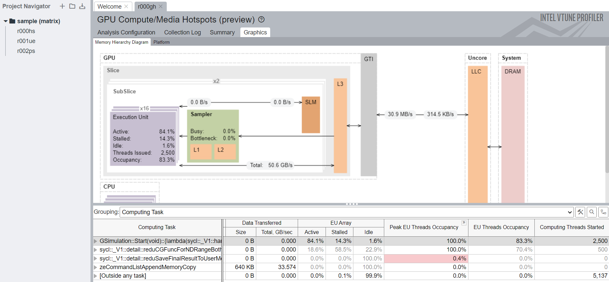

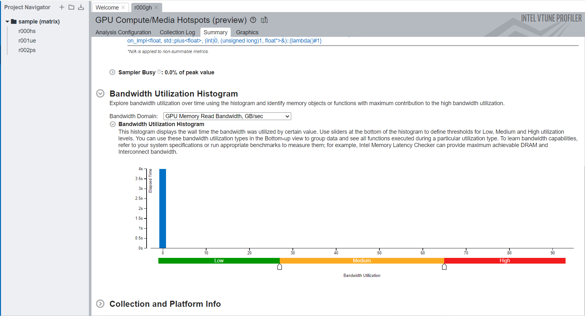

5. Realizar un análisis _**Roofline**_ con Advisor [4 puntos]
    - Indicar los hotspots del programa
    - Proporcionar screenshot(s) de los resultados
      - Por cada screenshot, añadir una breve descripción
    - Indicar potenciales soluciones para optimizar la ejecución del programa
## RESPUESTA_5:

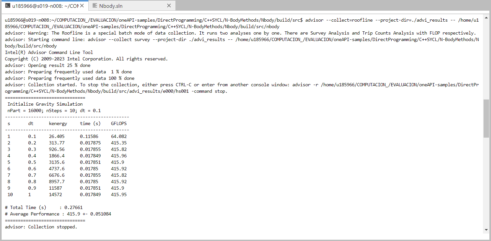

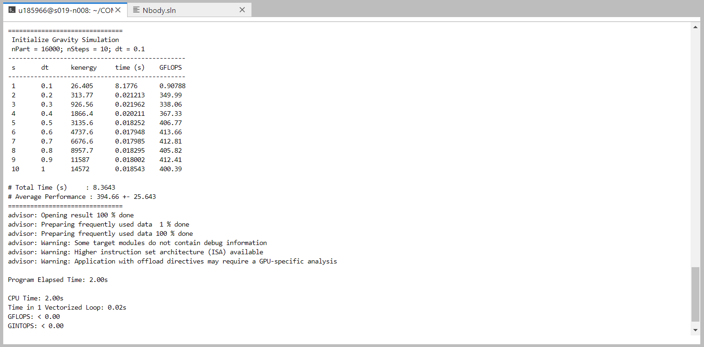

Generacion de archivo para VTUNE

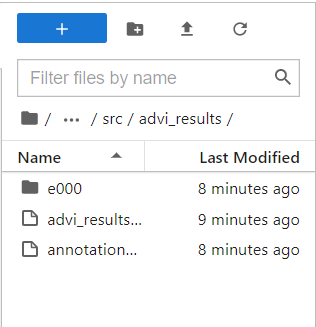

Evaluacion con VTUNE

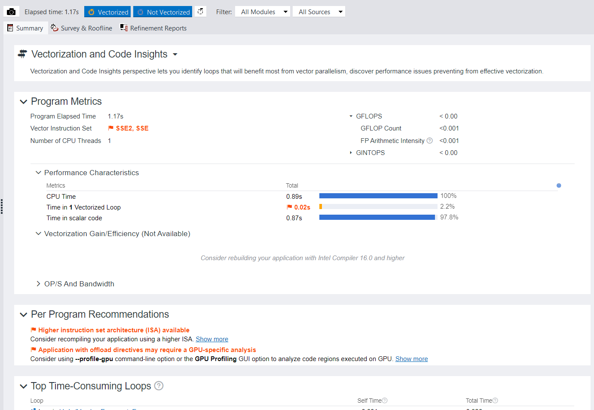

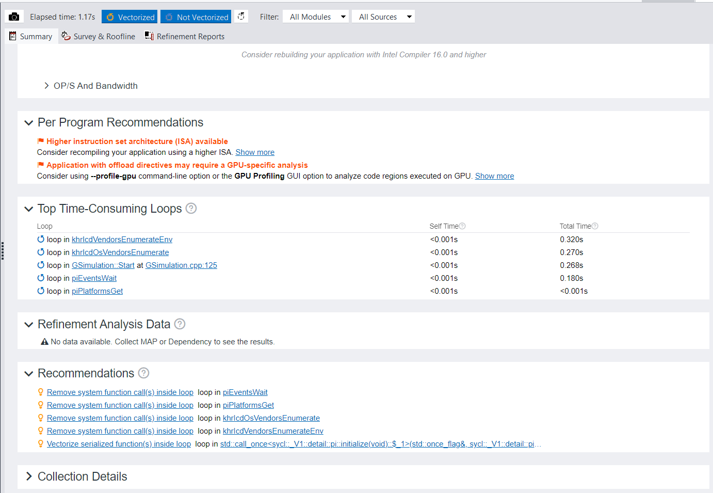

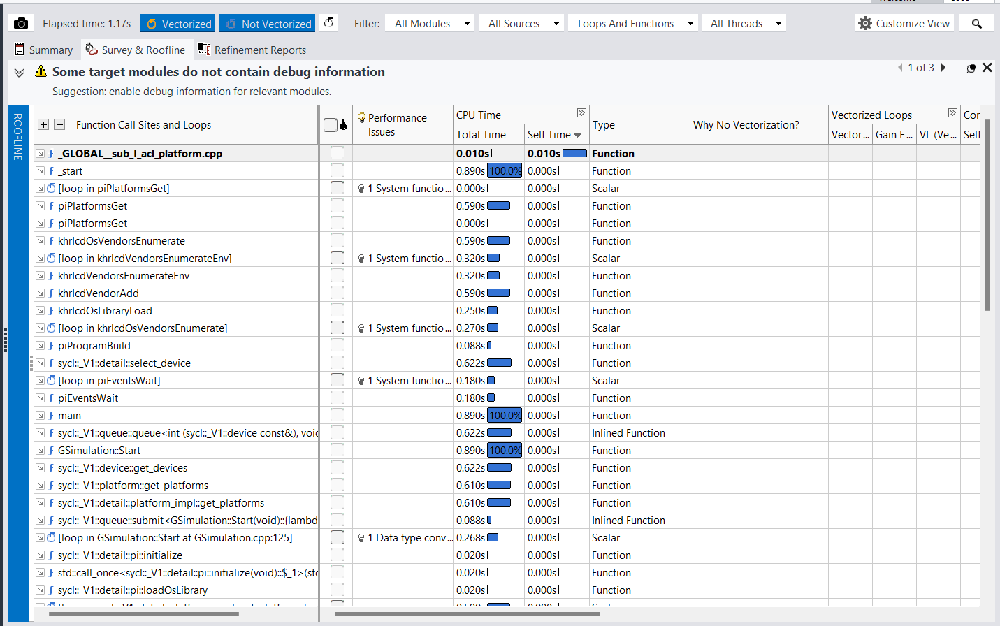

